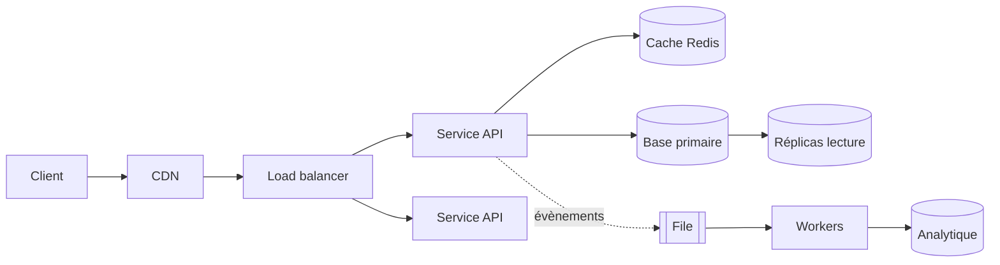

# La méthode, en détail

Cette fiche déroule les six temps de la SKILL.md, puis les applique
entièrement à un exemple. Ouvre-la quand le problème est ouvert (« conçois
un service qui… ») ou pour préparer un entretien.

## Sommaire

- [1. Cadrer](#1-cadrer)
- [2. Chiffrer](#2-chiffrer)
- [3. Définir l'interface](#3-définir-linterface)
- [4. Modéliser les données](#4-modéliser-les-données)
- [5. Dessiner le haut niveau](#5-dessiner-le-haut-niveau)
- [6. Approfondir et casser](#6-approfondir-et-casser)
- [Exemple complet : un raccourcisseur d'URL](#exemple-complet--un-raccourcisseur-durl)
- [Spécificités de l'entretien](#spécificités-de-lentretien)

## 1. Cadrer

Un système mal cadré est un système qu'on conçoit deux fois. Établis :

- **Le fonctionnel, en une phrase.** « Un utilisateur soumet une URL longue
  et reçoit une URL courte ; quiconque ouvre la courte est redirigé. »
- **Ce qui est hors périmètre**, dit explicitement. C'est aussi structurant
  que ce qui est dedans, et c'est ce que les gens oublient de demander.
- **Le non-fonctionnel**, qui décide vraiment de l'architecture :

| Dimension | La question à poser | Ce qu'elle change |
|---|---|---|
| Échelle | combien d'utilisateurs, de requêtes, d'objets ? | tout |
| Latence | quel p99 acceptable ? | cache, géodistribution, synchrone/asynchrone |
| Cohérence | une lecture périmée est-elle tolérable ? | choix du moteur, réplication |
| Disponibilité | que se passe-t-il si c'est coupé 1 h ? | redondance, budget |
| Durabilité | peut-on perdre une écriture ? | réplication, journal, sauvegardes |
| Lecture/écriture | quel ratio ? | cache et réplicas, ou partitionnement |
| Coût | quel budget mensuel ? | souvent l'arbitre réel |

Quand une réponse manque, **assume et écris l'hypothèse**. Bloquer sur une
question sans réponse ne produit rien ; une hypothèse fausse mais visible se
corrige en une ligne.

## 2. Chiffrer

Voir `chiffres.md` pour les formules et les ordres de grandeur. Écris les
calculs en clair : c'est la partie qu'un relecteur peut contester, donc la
partie qui a de la valeur. Un résultat sans son calcul n'est pas
vérifiable.

Trois nombres suffisent souvent à orienter toute la suite : QPS pic, volume
à un an, ratio lecture/écriture.

## 3. Définir l'interface

Trois à cinq opérations, avec entrées et sorties. Ce contrat est le meilleur
révélateur de problèmes précoces : si tu ne peux pas décrire proprement
l'entrée et la sortie d'une opération, c'est que le modèle de données n'est
pas au point.

```
POST /liens            { url, expiration? }  → { code, url_courte }
GET  /{code}                                 → 302 Location: url_longue
GET  /liens/{code}/stats                     → { clics, par_jour }
```

Pense dès ici à la pagination (curseur plutôt qu'offset), à l'idempotence des
écritures, et aux erreurs (que renvoie-t-on quand le code n'existe pas,
quand la limite de débit est atteinte).

## 4. Modéliser les données

**Le modèle avant le moteur.** Écris les entités, leurs relations et surtout
les **patrons d'accès** : « on lit toujours par code », « on liste les liens
d'un utilisateur triés par date ». Ce sont eux qui choisissent le moteur et
les index, pas une préférence de technologie. Détails dans `donnees.md`.

## 5. Dessiner le haut niveau

Une topologie lisible, du client au stockage, en nommant ce qui est
synchrone et ce qui ne l'est pas :



Le catalogue des briques et le prix de chacune est dans `briques.md`. Règle
de sobriété : **n'ajoute une brique que si tu peux nommer le chiffre qui
l'exige.** Un composant sans justification chiffrée est un composant à
retirer.

## 6. Approfondir et casser

C'est ici qu'une conception se juge. Prends les composants un par un et
demande :

- **Panne.** Si ce nœud tombe, que voit l'utilisateur ? Qui prend le relais,
  en combien de temps, et perd-on des données au passage ?
- **Charge.** Si le trafic est multiplié par 10, qui sature en premier ? Et à
  ×100 ?
- **Concurrence.** Deux écritures simultanées sur la même ligne : qui gagne,
  et est-ce le bon ? Faut-il un verrou optimiste, une transaction, une clé
  d'unicité ?
- **Rejeu.** Le client retente, la file redélivre : l'opération est-elle
  idempotente ?
- **Point chaud.** Une clé, un utilisateur ou une partition concentre-t-elle
  le trafic ? (Le compte à 50 millions d'abonnés casse le partitionnement
  par utilisateur.)
- **Démarrage à froid.** Après un redémarrage, le cache est vide : la base
  encaisse-t-elle la ruée ?
- **Exploitation.** Comment on déploie sans coupure, comment on revient en
  arrière, quelles métriques disent que ça va mal avant l'utilisateur.

Une réponse honnête à ces sept questions vaut mieux qu'un schéma de plus.

## Exemple complet : un raccourcisseur d'URL

**Cadrage.** Créer un lien court, rediriger. Hors périmètre : comptes
utilisateurs, édition d'un lien. Non fonctionnel : redirection p99 < 50 ms,
disponibilité 99,9 % en lecture (une redirection cassée est visible de tous),
99 % en écriture, données périmées tolérables en lecture.

**Chiffrage.** 100 M de créations/an → ~3 créations/s, pic ~15/s. Ratio
lecture/écriture supposé 100:1 → ~300 redirections/s, pic ~1 500/s.
Enregistrement ≈ 500 octets → 100 M × 500 o = **50 Go/an**, ×3 réplication =
150 Go. Conclusion immédiate : **tout tient sur une base relationnelle**, et
même l'index entier tient en mémoire. Pas de sharding, pas de NoSQL.

**Interface.** Les trois routes ci-dessus.

**Données.** Une table `liens(code PK, url, cree_le, expire_le, proprietaire)`.
Patron d'accès dominant : lecture par clé primaire. C'est le cas idéal du
cache.

Génération du code : un compteur global encodé en base 62 donne des codes
courts, séquentiels donc devinables ; un aléatoire de 7 caractères
(62⁷ ≈ 3,5×10¹²) est non devinable au prix d'une vérification de collision.
Pour ce cas, l'aléatoire avec contrainte d'unicité en base et une reprise sur
conflit est le bon compromis — le taux de collision reste négligeable jusqu'à
des milliards de liens.

**Haut niveau.** CDN pour les redirections (la réponse est une 302 cacheable
si l'on accepte de ne pas compter chaque clic à la source) → load balancer →
service sans état → Redis en lecture-à-travers → Postgres. Les clics partent
dans une file et sont agrégés par un worker : compter en synchrone
transformerait un système à 100 % de lecture en système à 100 % d'écriture,
et ferait sauter le chiffrage.

**Cassures.** Redis tombe : la base encaisse 1 500 QPS de lecture indexée,
elle tient — la dégradation est acceptable, on le dit. Un lien devient viral :
le cache absorbe, c'est justement le cas favorable. La file est en retard :
les statistiques prennent du retard, les redirections non — c'est le bon
découplage. Un client rejoue une création : sans clé d'idempotence il obtient
deux codes pour la même URL ; si c'est gênant, indexer l'URL par
propriétaire.

**Ce que ça coûte.** Les clics ne sont pas exacts en temps réel, et une
redirection peut servir une cible périmée pendant la durée de vie du cache.
Assumé, énoncé.

## Spécificités de l'entretien

- **Pense à voix haute.** L'intervieweur note le raisonnement, pas le schéma.
  Un choix expliqué et faux vaut mieux qu'un choix juste et muet.
- **Demande avant de dessiner.** Deux ou trois questions de cadrage
  changent tout, et ne pas les poser est le reproche le plus fréquent.
- **Gère le temps.** Sur 45 minutes : ~5 de cadrage, ~5 de chiffrage, ~10
  d'interface et de données, ~10 de schéma, ~15 d'approfondissement. C'est
  l'approfondissement qui différencie les candidats — n'y arrive pas à
  court de temps.
- **Ne récite pas une architecture.** Sortir Kafka et Cassandra sur un
  problème à 15 QPS montre exactement le contraire de ce qu'on évalue.
- **Assume tes compromis.** « Je choisis la cohérence à terme ici, parce que
  X, et le prix est Y » est la phrase attendue.
