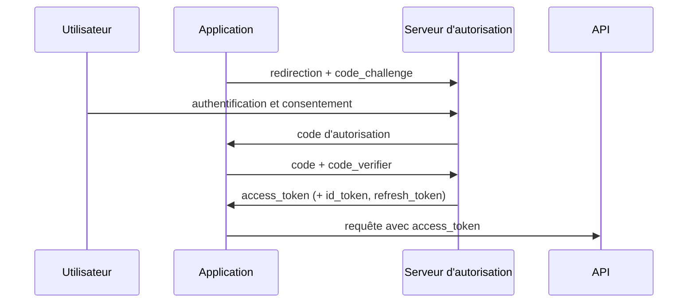

# Sécurité et exploitation

Un système n'est fini ni quand il marche, ni quand il tient la charge : il
l'est quand on peut le déployer sans coupure, savoir qu'il va mal avant les
utilisateurs, et empêcher qu'un compte compromis emporte tout.

## Sommaire

- [Authentification et autorisation](#authentification-et-autorisation)
- [Sessions ou jetons](#sessions-ou-jetons)
- [JWT](#jwt)
- [OAuth 2 et OpenID Connect](#oauth-2-et-openid-connect)
- [Mots de passe et facteurs](#mots-de-passe-et-facteurs)
- [TLS et chiffrement](#tls-et-chiffrement)
- [Secrets](#secrets)
- [Les failles applicatives à connaître](#les-failles-applicatives-à-connaître)
- [CI/CD](#cicd)
- [Stratégies de déploiement](#stratégies-de-déploiement)
- [Exploitation](#exploitation)

## Authentification et autorisation

Deux choses distinctes, et les confondre produit des failles :
**authentification** = qui es-tu ; **autorisation** = as-tu le droit de faire
ceci sur cet objet.

L'erreur la plus fréquente et la plus grave en pratique : vérifier
l'authentification et oublier l'autorisation **au niveau de l'objet**.
`GET /factures/1042` avec un jeton valide ne doit pas renvoyer la facture d'un
autre client. Chaque accès à une ressource doit vérifier l'appartenance —
côté serveur, jamais en se fiant à un identifiant fourni par le client.

Modèles : **RBAC** (droits par rôle — simple, suffit souvent), **ABAC**
(règles sur des attributs : service, région, heure), **ReBAC** (droits
dérivés d'une relation : « propriétaire du document », modèle Zanzibar).

## Sessions ou jetons

| | Session serveur | Jeton signé (JWT) |
|---|---|---|
| Stockage | côté serveur (Redis, base) | côté client |
| Révocation | immédiate | difficile avant expiration |
| Montée en charge | besoin d'un magasin partagé | sans état |
| Taille | identifiant court | charge utile complète à chaque requête |

Pour une application web classique, **le cookie de session reste le meilleur
choix** : révocation immédiate, cookie `HttpOnly` inaccessible au JavaScript,
et un magasin Redis partagé coûte peu. Le JWT prend l'avantage pour de
l'authentification entre services et des API sans état.

Cookies : `HttpOnly` (pas d'accès JS, donc protection contre le vol par XSS),
`Secure` (HTTPS uniquement), `SameSite=Lax` ou `Strict` (protection CSRF).

## JWT

Trois parties en base64url : en-tête, charge utile, signature.

```
{"alg":"RS256","typ":"JWT"} . {"sub":"42","exp":1730000000,"scope":"lecture"} . <signature>
```

Ce qu'il faut savoir avant d'en utiliser un :

- **Signé n'est pas chiffré.** La charge utile est lisible par quiconque.
  N'y mets rien de sensible.
- **Valide l'algorithme attendu côté serveur.** Accepter `alg` tel qu'il
  vient permet l'attaque `alg: none` et la confusion RS256/HS256.
- **La révocation est le vrai problème.** Un jeton volé reste valide jusqu'à
  son expiration. Réponse standard : jeton d'accès **court** (5 à 15 min) +
  jeton de rafraîchissement long, stocké et révocable côté serveur, avec
  rotation à chaque usage et détection de réutilisation.

## OAuth 2 et OpenID Connect

**OAuth 2 délègue une autorisation** (« cette application peut lire mes
fichiers »). **OIDC** est la couche d'identité posée dessus (« voici qui est
l'utilisateur »), qui ajoute l'`id_token`. Les deux sont régulièrement
confondus : OAuth seul ne prouve pas une identité.

Le flux à utiliser aujourd'hui, pour le web comme pour le mobile, est
**Authorization Code + PKCE** :



PKCE empêche l'interception du code par une application tierce. Le flux
implicite est obsolète, et le flux « mot de passe » (*password grant*) ne
doit plus être utilisé.

**SSO** : une authentification pour plusieurs applications, via OIDC ou SAML
(SAML reste courant en entreprise). **SCIM** sert au provisionnement des
comptes, souvent oublié dans la conception initiale alors qu'il conditionne
la désactivation d'un employé qui part.

## Mots de passe et facteurs

Hache avec un algorithme **lent et salé** conçu pour ça : **argon2id** de
préférence, sinon bcrypt ou scrypt. Jamais SHA-256 seul, jamais MD5 : leur
rapidité est exactement le défaut ici.

Limite les tentatives (par compte **et** par IP), et vérifie les mots de
passe contre les listes de fuites connues. Le second facteur par TOTP est
correct ; les clés WebAuthn/passkeys sont supérieures parce qu'elles résistent
au hameçonnage — le facteur est lié au domaine. Le SMS est le maillon faible
(échange de carte SIM) mais reste mieux que rien.

## TLS et chiffrement

- **En transit** : TLS 1.3 partout, y compris entre services internes si le
  réseau n'est pas de confiance. HSTS pour empêcher le repli en HTTP.
- **Au repos** : chiffrement du disque et de la base, avec des clés gérées
  par un service dédié (KMS) et une rotation prévue.
- **Symétrique** (AES) : rapide, une clé partagée. **Asymétrique** (RSA, EC) :
  paire publique/privée, lent, utilisé pour l'échange de clé et les
  signatures. TLS combine les deux : asymétrique pour la poignée de main,
  symétrique pour les données.

Ne conçois jamais ta propre cryptographie ni ton propre protocole
d'authentification. C'est le domaine où l'intuition échoue le plus.

## Secrets

Jamais dans le dépôt, jamais dans une image, jamais dans un journal. Un
gestionnaire (Vault, Secrets Manager, secrets du cloud) avec rotation, et
injection par variable d'environnement ou montage au démarrage. Un scanner de
secrets dans la CI attrape les fuites avant qu'elles ne partent — et un secret
poussé une fois est compromis même après suppression, il faut le **révoquer**,
pas seulement l'effacer de l'historique.

## Les failles applicatives à connaître

| Faille | Mécanisme | Parade |
|---|---|---|
| Injection SQL | de l'entrée utilisateur devient du code | requêtes paramétrées, systématiquement |
| XSS | du HTML/JS injecté s'exécute chez la victime | échappement à la sortie, CSP, cookies `HttpOnly` |
| CSRF | un site tiers déclenche une action authentifiée | `SameSite`, jeton anti-CSRF |
| IDOR | changer un identifiant donne accès à autrui | vérifier l'appartenance à chaque accès |
| SSRF | le serveur est forcé d'appeler une URL interne | liste blanche de destinations, blocage des IP privées |
| Désérialisation | des données deviennent des objets exécutables | ne jamais désérialiser une entrée non fiable |
| Dépendances vulnérables | une bibliothèque connue faillible | analyse de dépendances dans la CI, mise à jour |

Trois réflexes couvrent la majorité : **valider les entrées** contre un schéma
strict, **échapper à la sortie** selon le contexte de destination, **ne jamais
faire confiance à un identifiant venu du client**.

## CI/CD

**Intégration continue** : à chaque poussée, on construit, on teste, on
analyse. L'objectif n'est pas la cérémonie — c'est de découvrir un problème
dans la minute qui suit son introduction, quand le contexte est encore frais
et le coût de correction minimal.

Une chaîne raisonnable, ordonnée du plus rapide au plus lent, pour échouer
tôt :

```
lint → typage → tests unitaires → build → tests d'intégration
     → analyse de sécurité → publication de l'artefact → déploiement
```

**Livraison continue** : chaque commit sur la branche principale est
déployable. **Déploiement continu** : il est effectivement déployé, sans
intervention. Le second n'est possible qu'avec une confiance réelle dans les
tests et un retour arrière rapide.

Points qui font la différence en pratique : un pipeline **rapide** (au-delà de
10 minutes, les gens contournent), des artefacts **immuables** promus d'un
environnement à l'autre plutôt que reconstruits, et une infrastructure décrite
en code pour que les environnements ne divergent pas.

## Stratégies de déploiement

| Stratégie | Principe | Coût / bénéfice |
|---|---|---|
| Recréation | on arrête, on remplace | coupure ; à éviter |
| Progressive (*rolling*) | remplacement instance par instance | pas de coupure, deux versions coexistent |
| Bleu-vert | deux environnements, on bascule le trafic | retour arrière instantané, double infrastructure |
| Canari | 1 %, puis 10 %, puis 100 % | détection précoce, demande de bonnes métriques |

Deux conséquences à ne pas oublier : en progressif comme en canari, **deux
versions tournent en même temps** — le schéma de base et les contrats d'API
doivent donc rester compatibles dans les deux sens (voir le motif
expand/contract dans `donnees.md`).

Et sépare **déploiement** et **activation** : un drapeau de fonctionnalité
(*feature flag*) permet de livrer le code éteint, puis de l'allumer
progressivement et de l'éteindre en une seconde si ça tourne mal — sans
redéployer. C'est le retour arrière le plus rapide qui existe.

## Exploitation

- **SLI / SLO / SLA.** L'indicateur mesure (latence p99, taux de succès),
  l'objectif fixe le seuil interne, l'accord est l'engagement contractuel
  avec ses pénalités. Le **budget d'erreur** (1 − SLO) est l'outil utile : il
  arbitre entre livrer vite et stabiliser, avec un chiffre plutôt qu'une
  opinion.
- **Les quatre signaux dorés** : latence, trafic, erreurs, saturation. Si tu
  ne dois surveiller que quatre choses, ce sont celles-là.
- **Alerter sur les symptômes**, pas sur les causes. Une alerte doit être
  actionnable ; une alerte qu'on ignore trois fois est une alerte à supprimer,
  parce qu'elle entraîne à ignorer les autres.
- **Sauvegardes.** Une sauvegarde jamais restaurée n'est pas une sauvegarde.
  Teste la restauration périodiquement, et connais tes deux chiffres : **RPO**
  (données qu'on accepte de perdre) et **RTO** (temps qu'on accepte d'être
  coupé).
- **Post-mortem sans blâme.** L'objectif est la cause systémique et l'action
  corrective, pas le responsable. Un système qui punit l'erreur obtient le
  silence, pas la fiabilité.
